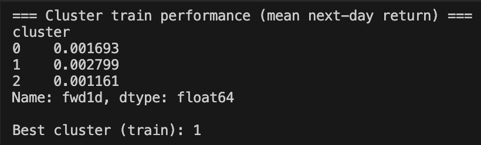
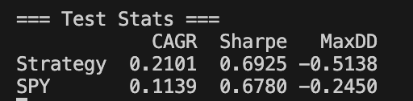
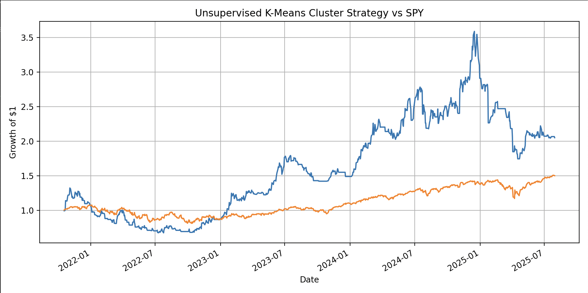

# Unsupervised Trading Strategy

An experimental project applying **unsupervised learning** (K-Means clustering) to stock market data.  
The strategy clusters daily features of S&P 500 stocks to identify **market regimes** and generate trading signals.  
Performance is then backtested against the **SPY benchmark** to evaluate risk-adjusted returns.

---

## 🚀 Features
- Fetches historical stock data with `yfinance`
- Extracts rolling features: momentum, volatility, and volume z-scores
- Applies **K-Means clustering** to discover hidden regimes
- Generates daily **long-only signals** from the most profitable cluster
- Backtests portfolio returns vs SPY benchmark
- Reports key performance metrics: CAGR, Sharpe Ratio, Max Drawdown
- Visualizes growth of $1 over the test period

---

## 📊 Results

### Cluster Training Performance

### Backtest Results

### Equity Curve

---

## 🛠️ Tech Stack
- **Python**
- `pandas`, `numpy` for data wrangling
- `yfinance` for market data
- `scikit-learn` for K-Means clustering
- `matplotlib` for visualization

---