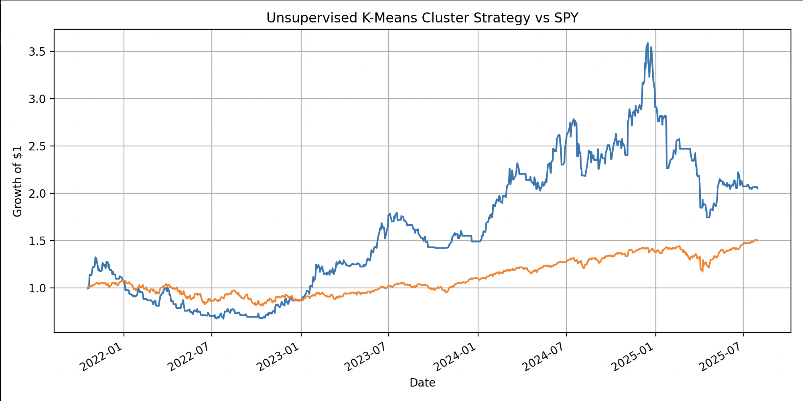

# Unsupervised Trading Strategy

the purpose of this project was to explore a concept i was learning about (unsupervised learning and particularly the K-Means algorithm) and applying it to my interest in financial markets, stocks specifically here. the strategy created clusters daily features of S&P 500 stocks to identify market regimes and generate trading signals. performance is then backtested against the SPY benchmark to evaluate risk-adjusted returns.

---

## Project Features
- fetches historical stock data with `yfinance`
- extracts rolling features: momentum, volatility, and volume z-scores
- applies K-Means clustering to discover the hidden regimes
- generates daily long-only signals from the most the cluster of stocks that have the highest returns
- backtests that stock portfolio returns vs SPY benchmark
- reports key performance metrics: **CAGR, Sharpe Ratio, Max Drawdown**
- visualizes growth of $1 over the test period for easier comparison
---

## Results

Cluster Training Performance

| cluster | fwd1d (mean next-day return) |
|---|---|
| 0 | 0.001693 |
| 1 | 0.002799 |
| 2 | 0.001161 |

Best cluster (train): 1

Backtest Results — Test Stats

| | CAGR | Sharpe | MaxDD |
|---|---|---|---|
| Strategy | 0.2101 | 0.6925 | -0.5138 |
| SPY | 0.1139 | 0.6780 | -0.2450 |

### Equity Curve

---
## Stack
- **python**
- `pandas`, `numpy` for data wrangling
- `yfinance` for market data
- `scikit-learn` for K-Means clustering
- `matplotlib` for visualization
---
